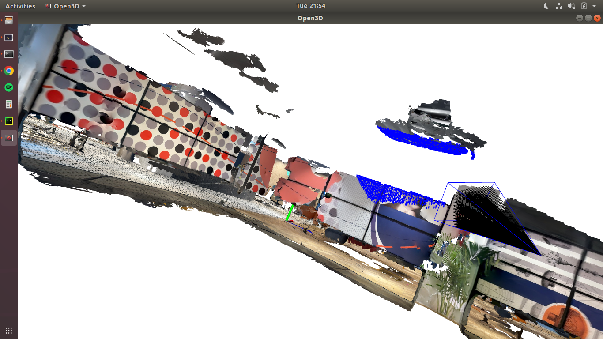
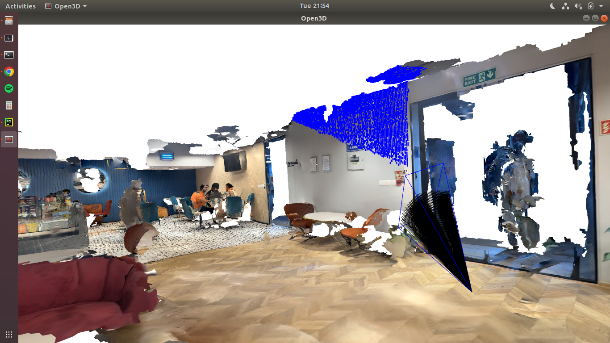
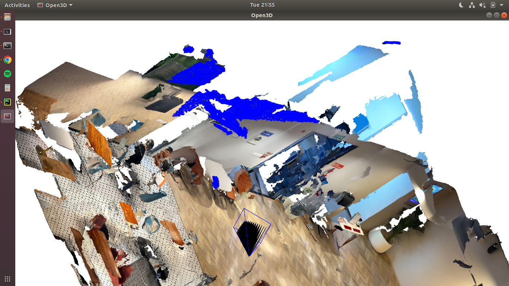

# Simulation
Mesh/Pointcloud Scanning Trajectory Simulation app. Mesh2D to images, depth conversions.
---
# Dependencies:

```
numpy~=1.24.4
pyquaternion~=0.9.9
PyYAML~=6.0.1
opencv-python~=4.8.1.78
open3d~=0.18.0
pandas~=2.0.3
```

# Steps:
- Install Requirements ```python3 -m pip install -r requirements.txt```
- Run the code : ```python3 Simulator.py```

# Keep in Mind!
- By default , it will pick "OfficeArway.glb" in ```./data``` folder. but you can edit input/output path in the main code.
- All results will be saved in ```./data/Arway``` folder , with respective __depth/{frame_no.png} format with calibration files and poses in __poses.csv.
- Turn On/Off Visualizer in Simulator.py file in ->if __name__ == '__main__'. ```App.run(save=True, show=True)```

# How to view the Results:
- color : ```blue points``` are the intersecting faces w.r.t to camera.
- color : ```blue lines``` are the camera fov. 
- color : ```black lines``` are rays which I have reduced the density for better view.
- SS1: 
- SS2: 
- SS3: 


# Note
- Feel free to contact  in Any Manner for doubts , or if code is not working. Sometimes Linux to windows crossplatfrom may cause path issues, which already care has been taken.

